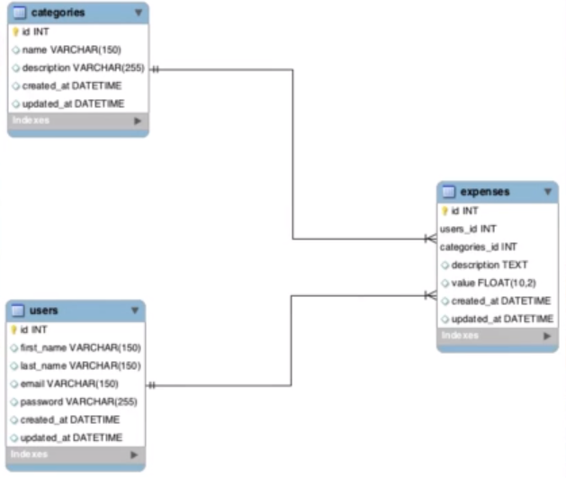

# Orientação a Objetos com PHP - Crie 5 Projetos Práticos

https://www.udemy.com/course/php-orientado-a-objetos-do-0-a-pratica/

Aprenda PHP Orientado a Objetos na prática! E ainda construa 5 projetos práticos.

## <a name="indice">Índice</a>

1. [Introdução & Ambiente](#parte1)     
2. [Configuração de Ambiente](#parte2)     
3. [Conceitos Básicos de OO](#parte3)     
4. [Métodos Mágicos](#parte4)     
5. [Autoload & Namespaces](#parte5)     
6. [Mais OO no PHP](#parte6)     
7. [Exceptions](#parte7)     
8. [Projeto 1 - Site Institucional](#parte8)     
9. [Projeto 2 - Catálogo de Produtos](#parte9)     
10. [Projeto 3 - Mini-Gerenciador de Gastos Pessoais](#parte10)     
11. [Projeto 4 - Blog](#parte11)     
12. [Break Up - Relacionamento entre Objetos](#parte12)     
13. [Projeto Final - Primeira Etapa (Admin)](#parte13)     
14. [Projeto Final - Segunda Etapa (Front Loja)](#parte14)     
15. [Etapa Final - PagSeguro Checkout Transparente](#parte15)     
---


## <a name="parte1">1 - Introdução & Ambiente</a>

Repositório do Instrutor:
- [https://github.com/CodeExpertsLearning/orientacao-a-objetos-com-php-regravacao](https://github.com/CodeExpertsLearning/orientacao-a-objetos-com-php-regravacao)

[Voltar ao Índice](#indice)

---


## <a name="parte2">2 - Configuração de Ambiente</a>

- XAMPP + Condifg PHP in PATH

[Voltar ao Índice](#indice)

---


## <a name="parte3">3 - Conceitos Básicos de OO</a>

#### 3.7. Classes & Objeto

```php
<?php


class car
{
    public $color;
    public $years;
    public $model;

    public function run()
    {
        return $this->model . " Car is Running";
    }

    public function stop()
    {
        return $this->model . " Car is Stop";
    }
}

$car = new Car();
$car->model = "Car";
$car->color = "red";
$car->years = 2000;

$car2 = new Car();
$car2->model = "Car 2";
$car2->color = "blue";
$car2->years = 2020;

print $car->run();
print "\n";
print $car->stop();

print "\n";

print $car2->run();
print "\n";
print $car2->stop();
```

#### 3.8. Construtores & Destrutores

```php
class car
{
    public $color;
    public $years;
    public $model;

    /**
     * car constructor.
     * @param $color
     * @param $years
     * @param $model
     */
    public function __construct($color, $years, $model)
    {
        $this->color = $color;
        $this->years = $years;
        $this->model = $model;
    }
    public function run()
    {
        return $this->model . " Car is Running";
    }
    public function stop()
    {
        return $this->model . " Car is Stop";
    }
    public function __destruct()
    {
        print "\n REMOVENDO Objeto" . __CLASS__ ;
    }
}
$car = new Car("Red", "2000", "HONDA");
//$car->model = "Car";
//$car->color = "red";
//$car->years = 2000;

$car2 = new Car("BLUE0", "2020", "RENAULT");
//$car2->model = "Car 2";
//$car2->color = "blue";
//$car2->years = 2020;

print $car->run();
print "\n";
print $car->stop();

print "\n";

print $car2->run();
print "\n";
print $car2->stop();
/*
HONDA Car is Running
HONDA Car is Stop
RENAULT Car is Running
RENAULT Car is Stop
 REMOVENDO Objetocar
 REMOVENDO Objetocar
*/
```


#### 3.9. Herança

```php
<?php

class Animal
{
    public $name;

    public function sleep()
    {
        return $this->name . " are sleeping... \n";
    }
}

class Dog extends Animal
{
    public function sleep()
    {
        print parent::sleep();
        return "Dog SLEEEEEEEEPING \n";
    }
}

class Bird extends Animal
{

}

$dog1 = new Dog();
$dog1->name = "TED";
print $dog1->sleep();

$bird = new Bird();
$bird->name = "Balack Bird";
print $bird->sleep();
```

#### 3.10. Visibilidade

```php
<?php


class Person
{
    public $name;
    //protected $age = 30;
    private $age = 30;

    public function showName ()
    {
        return $this->name;
    }

    public function age()
    {
        return $this->age();
    }
}

class Woman extends Person
{
    public function showWomanAge()
    {
        //return $this->age;
        return $this->age();
    }
}

$person = new Woman();
$person->name = "Luci";
//$person->age = 20;
print $person->showName() . " " . $person->showWomanAge();
```

#### 3.11. Encapsulamento

```php
<?php


class BankAccount
{
    public $balance = 0;

    public function __construct()
    {
        $this->balance = 30;
    }

    public function deposit($money)
    {
        $this->balance += $money;
    }

    public function withDraw($money)
    {
        if ($money > $this->balance) {
            return false;
        }

        $this->balance -= $money;
    }
}

$bankAccaout1 = new BankAccount();
$bankAccaout1->deposit(10);
$bankAccaout1->deposit(20);

print $bankAccaout1->balance; // propriedade deve ser private 
```

#### 3.12. Getters & Setters

```php
    public function getBalance()
    {
        return $this->balance;
    }

```

```php
<?php


class Product
{
    private $name;
    private $price;
    private $description;

    public function getName()
    {
        return $this->name;
    }

    public function setName($name)
    {
        $this->name = $name;
    }

    public function getPrice()
    {
        return $this->price;
    }

    public function setPrice($price)
    {
        $this->price = $price;
    }

    public function getDescription()
    {
        return $this->description;
    }
    public function setDescription($description)
    {
        $this->description = $description;
    }
}

$produto_1 = new Product();
$produto_1->setName("Vassoura");
$produto_1->setPrice(10);
$produto_1->setDescription("Vassoura TIpo 1");
print $produto_1->getName() . " Preço de R$ " . $produto_1->getPrice() ;

```


#### 3.13. Classes Abstratas

```php
<?php

abstract class Animal
{

    private $name;

    public function run()
    {
        return "Animal is running";
    }

    abstract public function sound();

}

class Dog extends Animal
{
    public function sound()
    {
        return "Au AU au";
    }
}

$animal = new Dog();
print $animal->run();
print "\n";
print $animal->sound();
```

#### 3.14. Interfaces

```php
<?php

interface Animal
{
    public function sound();
    public function run();
}

class Dog implements Animal
{
    public function sound()
    {
        return "Au au AU";
    }

    public function run()
    {
        return "DOG IS RUNNNN";
    }
}

$dog1 = new Dog();
print $dog1->run();
print "\n";
print $dog1->sound();
print "\n";
print $dog1 instanceof Animal;
print "\n";
print $dog1 instanceof Dog;
/*
DOG IS RUNNNN
Au au AU
1
1
*/


```

#### 3.15. Polimorfismo

```php
<?php


abstract class Printer
{
    public function toPrint()
    {
        return "Printing... original";
    }
}

class HPPrinter extends Printer
{
    public function toPrint()
    {
        return "Printing in HP....";
    }
}

class Epson extends Printer
{
    public function toPrint()
    {
        return "Pring in Epson";
    }

    /*
    public function toPrint($papel) // PHP não permite
    {
        return $papel . " teste papel";
    }
    */
}

$print = new Epson();
print $print->toPrint();
```

#### 3.16. Métodos & Atributos Estáticos

```php
<?php

class Html
{
    public static $mailTag = "<html>";
    const END_TAG = "</html>";

    public static function openTagHtml()
    {
        return self::$mailTag;
    }

    public static function EndTagHtml()
    {
        return self::END_TAG;
    }
}

print Html::openTagHtml();
print Html::EndTagHtml();
print "\n";
print html::$mailTag;
print html::END_TAG;

```

#### 3.17. Palavra Reservada Final (Classes e métodos)

```php
<?php

final class User
{
    private $name;

    public function getName()
    {
        return $this->name;
    }

    final public function setName($name)
    {
        $this->name = $name;
    }
}
```

[Voltar ao Índice](#indice)

---


## <a name="parte4">4 - Métodos Mágicos</a>

#### 4.18. Introdução

#### 4.19. __set & __get

- [04-Metodos_Magicos/MetodosMagicos.php](04-Metodos_Magicos/MetodosMagicos.php)

```php
<?php


class Produto
{
/*    public function __set($name, $value)
    {
        var_dump($name, $value);
    }*/
    public $props = [];
    public function __set($name, $value)
    {
        $this->props[$name] = $value;
    }

    public function __get($name)
    {
        return $this->props[$name];
    }


}

$produto = new Produto();
$produto->name = "Prouto teste 1";
$produto->price = 12.99;
/*
string(4) "name"
string(14) "Prouto teste 1"
string(5) "price"
float(12.99)
*/

// var_dump($produto->props);

/*
 array(2) {
  ["name"]=>
  string(14) "Prouto teste 1"
  ["price"]=>
  float(12.99)
}
*/

var_dump($produto->price);

```

#### 4.20. __call & __callStatic

- [04-Metodos_Magicos/CallCallStatic.php](04-Metodos_Magicos/CallCallStatic.php)

```php
<?php

class ProdutoCallCallStatic
{
    public function __call($name, $arguments)
    {
        var_dump($name, $arguments);
        /*
            string(4) "save"
            array(2) {
              [0]=>
              string(9) "Produto 1"
              [1]=>
              float(20.99)
            }
         */
    }

    public static function __callStatic($name, $arguments)
    {
        var_dump($name, $arguments);
        /*
         array(2) {
          [0]=>
          string(8) "Conect 1"
          [1]=>
          int(200)
        }
         * */
    }
}
$produto = new ProdutoCallCallStatic();
$produto->save("Produto 1", 20.99); // método não existe, com parametros

ProdutoCallCallStatic::getConnection("Conect 1", 200); // métodos estáticos

```

#### 4.21. __toString

- [04-Metodos_Magicos/MM_tostring.php](04-Metodos_Magicos/MM_tostring.php)

```php
<?php

class ProtudosToString
{
    public function __toString()
    {
        return "Retorno toString da classe " . __CLASS__; // sempre uma string ou exceptions v7.4
    }
}

$produto = new ProtudosToString();
print $produto; // Retorno toString da classe ProtudosToString
```

#### 4.22. Conclusões

[Voltar ao Índice](#indice)

---


## <a name="parte5">5 - Autoload & Namespaces</a>

#### 5.23. Autoload 101

- [05-Autoload_Namespaces/index.php](05-Autoload_Namespaces/index.php)

```php
<?php

//require __DIR__ . "/class/JsonExport.php";
//require __DIR__ . "/class/XmlExport.php";

function autoload($class)
{
    require __DIR__ . "/class/".$class.".php";
}

spl_autoload_register('autoload');


if ($_GET['export'] == 'xml') {
    print (new XmlExport())->doExport();
}
if ($_GET['export'] == 'json') {
    print (new JsonExport())->doExport();
}

```
- [05-Autoload_Namespaces/class/XmlExport.php](05-Autoload_Namespaces/class/XmlExport.php)
- [05-Autoload_Namespaces/class/JsonExport.php](05-Autoload_Namespaces/class/JsonExport.php)

#### 5.24. Conhecendo Namespaces

- [05-Autoload_Namespaces/nameSpace/index.php](05-Autoload_Namespaces/nameSpace/index.php)
```php
<?php

//require __DIR__ . "/class/JsonExport.php";
//require __DIR__ . "/class/XmlExport.php";

use Export\JsonExport;
use Export\XmlExport;

function autoload($class)
{
    $baseFolder = __DIR__ . '/src/';
    $class = str_replace('\\', '/', $class);
    require $baseFolder . $class . '.php';
}

spl_autoload_register('autoload');


if ($_GET['export'] == 'xml') {
    print (new XmlExport())->doExport();
}
if ($_GET['export'] == 'json') {
    print (new JsonExport())->doExport();
}

```

- [05-Autoload_Namespaces/nameSpace/src/Export/JsonExport.php](05-Autoload_Namespaces/nameSpace/src/Export/JsonExport.php)

```php
<?php

namespace Export;

use Export\Contract\Export;

class JsonExport implements Export
{
    public function doExport()
    {
        return "Json Export";
    }
}
```
- [05-Autoload_Namespaces/nameSpace/src/Export/XmlExport.php](05-Autoload_Namespaces/nameSpace/src/Export/XmlExport.php)
- [05-Autoload_Namespaces/nameSpace/src/Export/Contract/Export.php](05-Autoload_Namespaces/nameSpace/src/Export/Contract/Export.php)

```php
<?php

namespace Export\Contract;

interface Export
{

}
```

#### 5.25. Autoload PSR-4

- [05-Autoload_Namespaces/nameSpace/autoload_psr4.php](05-Autoload_Namespaces/nameSpace/autoload_psr4.php)

```php
<?php

//https://github.com/php-fig/fig-standards/blob/master/accepted/PSR-4-autoloader-examples.md

spl_autoload_register(function ($class) {

    // project-specific namespace prefix - namespace BASE
    $prefix = 'Code\\';

    // base directory for the namespace prefix
    $base_dir = __DIR__ . '/src/';

    // does the class use the namespace prefix?
    $len = strlen($prefix);
    if (strncmp($prefix, $class, $len) !== 0) {
        // no, move to the next registered autoloader
        return;
    }

    // get the relative class name
    $relative_class = substr($class, $len);

    // replace the namespace prefix with the base directory, replace namespace
    // separators with directory separators in the relative class name, append
    // with .php
    $file = $base_dir . str_replace('\\', '/', $relative_class) . '.php';

    // if the file exists, require it
    if (file_exists($file)) {
        require $file;
    }
});
```

- [05-Autoload_Namespaces/nameSpace/index.php](05-Autoload_Namespaces/nameSpace/index.php)

```php
<?php

//require __DIR__ . "/class/JsonExport.php";
//require __DIR__ . "/class/XmlExport.php";

//use Export\JsonExport;
//use Export\XmlExport;

use Code\Export\{
    JsonExport, XmlExport
};

require __DIR__ . '/autoload_psr4.php';
/*
function autoload($class)
{
    $baseFolder = __DIR__ . '/src/';
    $class = str_replace('\\', '/', $class);
    require $baseFolder . $class . '.php';
}

spl_autoload_register('autoload');
*/


if ($_GET['export'] == 'xml') {
    print (new XmlExport())->doExport();
}
if ($_GET['export'] == 'json') {
    print (new JsonExport())->doExport();
}

```

- [05-Autoload_Namespaces/nameSpace/src/Export/XmlExport.php](05-Autoload_Namespaces/nameSpace/src/Export/XmlExport.php)

```php
<?php

namespace Code\Export;

use Code\Export\Contract\Export;

class XmlExport implements Export
{
    public function doExport()
    {
        return "XML EXPORT";
    }
}
```

- [05-Autoload_Namespaces/nameSpace/src/Export/JsonExport.php](05-Autoload_Namespaces/nameSpace/src/Export/JsonExport.php)
- [05-Autoload_Namespaces/nameSpace/src/Export/Contract/Export.php](05-Autoload_Namespaces/nameSpace/src/Export/Contract/Export.php)


#### 5.26. Autoload com Composer

- [05-Autoload_Namespaces/autoload-composer/composer.json](05-Autoload_Namespaces/autoload-composer/composer.json)

```json
{
  "autoload": {
    "psr-4": {
      "Code\\": "src/"
    }
  }
}

```

```php
require __DIR__ . '/vendor/autoload.php';
```

```
composer dump
# ou
composer dump-autoload
```

[Voltar ao Índice](#indice)

---


## <a name="parte6">6 - Mais OO no PHP</a>

#### 6.27. Type Hiting

```php
<?php
declare(strict_types=1);

class Product
{
    private $name;
    private $price;

    public function getName()
    {
        return $this->name;
    }

    public function setName(string $name)
    {
        $this->name = $name;
    }

    public function getPrice()
    {
        return $this->price;
    }

    public function setPrice(float $price)
    {
        $this->price = $price;
    }
}

class Cart
{
    private $itens = [];

    public function addProduct(Product $product) // Declaração
    {
        $this->itens[] = $product;
    }

    public function getItens(): array // declaração tipo return
    {
        return $this->itens;
    }
}

$produtuo1 = new Product();
$produtuo1->setName("Produto 1");
$produtuo1->setPrice(20.99);

$produtuo2 = new Product();
$produtuo2->setName("Produto 2");
$produtuo2->setPrice(100.99);

$cart = new Cart();
$cart->addProduct($produtuo1);
$cart->addProduct($produtuo2);

var_dump($cart->getItens());
/*
 array(2) {
  [0]=>
  object(Product)#1 (2) {
    ["name":"Product":private]=>
    string(9) "Produto 1"
    ["price":"Product":private]=>
    float(20.99)
  }
  [1]=>
  object(Product)#2 (2) {
    ["name":"Product":private]=>
    string(9) "Produto 2"
    ["price":"Product":private]=>
    float(100.99)
  }
}

 */

print "PRoduto " . $produtuo1->getName() . "Preço R$ " . $produtuo1->getPrice();
// PRoduto Produto 1Preço R$ 20.99
```

#### 6.28. Traits 101

```php
<?php

trait uploadTrait
{
    public function doUpload($file)
    {
        return true;
    }
}

class Productss
{
    use uploadTrait;
}

class Profile
{
    use uploadTrait;
}

$prod1 = new Productss();
print $prod1->doUpload("arquivo...."); //  1

print "<br>";

$prod2 = new Profile();
print $prod2->doUpload("arquivo 2....");//  1

```

#### 6.29. Traits Particularidades

- [06-Mais_OO_no_PHP/traitExemplos.php](06-Mais_OO_no_PHP/traitExemplos.php)

```php
<?php

trait Mytrait
{
    public function Hello()
    {
        return "Olá mundo Trait 1";
    }
}

trait Mytrait2
{
    public function showName($name)
    {
        return " Olá, " . $name;
    }
    public function Hello()
    {
        return "Olá mundo de Trait 2";
    }
}

class Client
{
    use Mytrait, Mytrait2 {
        Mytrait2::Hello insteadof Mytrait; // usar o hello de mytrait
        Mytrait::Hello as AliasHellow; // ALIAS

        Mytrait::Hello as private helloVisibilitPrivate; // modificando a visibilidade do método
    }

    public function teste()
    {
        return $this->helloVisibilitPrivate();
    }
}

$c = new Client();
print $c->Hello();
print "<br>";
print $c->AliasHellow();
print "<br>";
print $c->showName("José");

```

#### 6.30. Classes Anônimas

```php
<?php

$classAnonymous = new class{
    public function log($message)
    {
        return $message;
    }
};

class BackAccount
{
    public function withDraw($value, $classAnonymous)
    {
        return $classAnonymous->log("Loggin... WithDraw....");
    }
}

$bank = new BackAccount();
print $bank->withDraw(20, $classAnonymous);
// Loggin... WithDraw....
```

[Voltar ao Índice](#indice)

---


## <a name="parte7">7 - Exceptions</a>

#### 7.31. Conhecendo Exceptions

- [https://www.php.net/throwable](https://www.php.net/throwable)

```php
<?php

use CodeException\Sum;

require __DIR__ . "/vendor/autoload.php";

try {
    $sum = new Sum();
    print $sum->doSum(10);

}catch (\Error $e){
    print_r($e->getTrace());
}

```


#### 7.32. Lançando Exceptions

- [https://3v4l.org/f8Boe](https://3v4l.org/f8Boe)

```php
<?php

use CodeException\Sum;

require __DIR__ . "/vendor/autoload.php";

try {
    $sum = new Sum();
    print $sum->doSum(10, 9);

}catch (\Error $e){
    print_r($e->getTrace());
}catch (\Exception $e){
    print $e->getMessage();
}

```

```php
<?php

namespace CodeException;

class Sum{
    public function doSum($num1, $num2)
    {
        if ($num2 >= 10) {
            throw new \Exception("Parametro 2 deve ser menor ou igual a 10");
        }
        return $num1 + $num2;
    }
}
```

#### 7.33. Exceptions Customizadas

```php
<?php

namespace CodeException\MyExceptions;

use Throwable;

class MyCustomException extends \Exception
{
    /**
     * MyCustomException constructor.
     */
    public function __construct($message = "Minha Mensagem customizada", $code = 0, Throwable $previous = null)
    {
        parent::__construct($message, $code, $previous);
    }
}
```

```php
<?php

use CodeException\Sum;


require __DIR__ . "/vendor/autoload.php";

try {
    $sum = new Sum();
    print $sum->doSum(10, 20);

}/* catch (\Error $e) {
    print_r($e->getTrace());
}*/ catch (\CodeException\MyExceptions\MyCustomException $e) {
    print $e->getMessage();
}

```

#### 7.34. Bloco Finally

```php
<?php

use CodeException\Sum;


require __DIR__ . "/vendor/autoload.php";

try {
    $sum = new Sum();
    print $sum->doSum(10, 9);

} catch (\Error $e) {
    print_r($e->getTrace());
} catch (\CodeException\MyExceptions\MyCustomException $e) {
    print $e->getMessage();
} finally {
    print "  Finaly"; // Save de um log
}
```

[Voltar ao Índice](#indice)

---


## <a name="parte8">8 - Projeto 1 - Site Institucional</a>

### 8.35. Iniciando Projeto

- [https://github.com/CodeExpertsLearning/php-basico-online](https://github.com/CodeExpertsLearning/php-basico-online)

### 8.36. Iniciando FrontController
### 8.37. Manipulando Controllers em nosso FrontController
### 8.38. Concluindo FrontController

- [08-Projeto-1-Site_Institucional/index.php](08-Projeto-1-Site_Institucional/index.php)

```php
<?php
require __DIR__ . '/../08-Projeto-1-Site_Institucional/vendor/autoload.php';


$url = substr($_SERVER['REQUEST_URI'], 1);
$url = explode('/', $url);

$controller = isset($url[0]) && $url[0] ? $url[0] : 'page';
$action     = isset($url[1]) && $url[1] ? $url[1] : 'index';
$param      = isset($url[2]) && $url[2] ? $url[2] :  null;

if (!class_exists($controller = "\Code\Controller\\" . ucfirst($controller) . 'Controller')) {
    die("404 - Página não encontrada");
}
if (!method_exists($controller, $action)) {
    $action = 'index';;
    $param = $url[1];
}

$response = call_user_func_array([new $controller, $action], [$param]);
print $response;
```

### 8.39. Iniciando Classe View
### 8.40. Testando e Criando Primeira View
### 8.41. Comentários Aula
### 8.42. Incrementando Projeto Adicionando Bootstrap
### 8.43. Criando Página Sobre
### 8.44. Criando Página Contato
### 8.45. Concluindo Projeto


[Voltar ao Índice](#indice)

---


## <a name="parte9">9 - Projeto 2 - Catálogo de Produtos</a>

#### 9.46. Iniciando Projeto Catálogo
#### 9.47. Entity para Manipular Dados
#### 9.48. Recuperando Produtos
#### 9.49. Produtos na View
#### 9.50. Recuperando Produto Especifico
#### 9.51. Criando Single de Produto
#### 9.52. Melhorando - Classe de Conexão com Banco & Concluindo

[Voltar ao Índice](#indice)

---


## <a name="parte10">10 - Projeto 3 - Mini-Gerenciador de Gastos Pessoais</a>

#### 10.53. Apresentando Projeto



#### 10.54. Melhorando Entity (FindAll & Where)


#### 10.55. Testando Entity (Where) & criando método Find
#### 10.56. Criando Método Insert no Entity
#### 10.57. Criando Método Update no Entity
#### 10.58. Criando Método Delete no Entity
#### 10.59. Organizando Projeto
#### 10.60. Iniciando Cadastro de Gastos
#### 10.61. Processando Cadastro
#### 10.62. Gerando Banco de Dados - MyExpenses
#### 10.63. Lançando Exceptions no PDO
#### 10.64. Concluindo Cadastro de Gastos
#### 10.65. Listando Gastos - View
#### 10.66. Iniciando Tela de Edição
#### 10.67. Processando Edição & Remoção de Gastos
#### 10.68. Criando Classe Session
#### 10.69. Iniciando Authenticator
#### 10.70. Testando e Criando Tela de Login
#### 10.71. Controlando Acesso ao Painel
#### 10.72. Criando Mensagens Flash
#### 10.73. Recuperando Despesas do Usuário e Concluindo

[Voltar ao Índice](#indice)

---


## <a name="parte11">11 - Projeto 4 - Blog</a>

#### 11.74. Iniciando Projeto
#### 11.75. Considerações Sobre o Banco de Dados do Projeto
#### 11.76. Primeiras Modificações do Blog
#### 11.77. Iniciando CRUD de Postagens
#### 11.78. Inserindo Primeira Postagem
#### 11.79. Editando/Atualizando Posts
#### 11.80. Removendo Postagens
#### 11.81. Sanitizando Dados de Entrada
#### 11.82. Validando Dados de Entrada
#### 11.83. Melhorias no Controller de Posts
#### 11.84. CRUD de Usuários
#### 11.85. Hash de Senha em CRUD de Usuários
#### 11.86. CRUD de Categorias
#### 11.87. Associando Categorias com Posts
#### 11.88. Modificando Login (Check de Senha com Hash)
#### 11.89. Ajustes Projeto
#### 11.90. Criando Home & Single do Blog
#### 11.91. Melhorias Home & Single
#### 11.92. Listando Posts por Categoria
#### 11.93. Gerando Slug Automático & Concluindo

[Voltar ao Índice](#indice)

---


## <a name="parte12">12 - Break Up - Relacionamento entre Objetos</a>

#### 12.94. Introdução
#### 12.95. Associação
#### 12.96. Agregação
#### 12.97. Composição
#### 12.98. Conclusões

[Voltar ao Índice](#indice)

---


## <a name="parte13">13 - Projeto Final - Primeira Etapa (Admin)</a>

#### 13.99. Intro Projeto
#### 13.100. Melhorias na Estrutura do Projeto
#### 13.101. Continuando Melhorias & Correções
#### 13.102. Tela Inicial de Gerenciamento de Produtos
#### 13.103. Entidade Produto & Busca no BD
#### 13.104. Iniciando Criação de Produto
#### 13.105. Salvando Produto no BD
#### 13.106. Validações & Sanitização para Produtos
#### 13.107. Iniciando Edição de Produto
#### 13.108. Processando Edição de Produto
#### 13.109. Removendo Produtos
#### 13.110. Iniciando Upload de Imagens do Produto
#### 13.111. Modificações no Form para Upload de Imagens
#### 13.112. Realizando Upload de Fotos do Produto
#### 13.113. Associando Fotos ao Produto em questão
#### 13.114. Validando Imagens Enviadas
#### 13.115. Testando Validação & Upload em Edição de Produtos
#### 13.116. Testando Edição de Imagens em Produtos
#### 13.117. Recuperando Imagens de Produtos na Edição
#### 13.118. Query Utilizada na Busca de Produto & Imagens
#### 13.119. Organizando Array de Retorno de Produto & Suas Imagens
#### 13.120. Exibindo Produtos na Edição de Imagens
#### 13.121. Removendo Imagens do Produto Pt 1
#### 13.122. Concluindo Remoção das Imagens do Produto
#### 13.123. Iniciando Associação de Produtos & Categorias
#### 13.124. Query de Alteração em Categorias Table
#### 13.125. Testando Criação de Produtos com suas Categorias
#### 13.126. Melhorias na criação de Produtos com suas Categorias
#### 13.127. Editando Produto com Categorias
#### 13.128. Sincronizando Produtos & Categorias (Muitos para Muitos)
#### 13.129. Concluindo Edição de Produto com Categorias
#### 13.130. Melhorias na Criação e Edição de Produtos
#### 13.131. Melhorias na Condição de Upload de Imagens
#### 13.132. Blocos Try...Catch & Concluindo Etapa

[Voltar ao Índice](#indice)

---


## <a name="parte14">14 - Projeto Final - Segunda Etapa (Front Loja)</a>

#### 14.133. Introdução
#### 14.134. Criando Home
#### 14.135. Criando Single Produto
#### 14.136. Criando Carrinho de Compras
#### 14.137. Cancelando Carrinho & Removendo Itens
#### 14.138. Melhorias Layout
#### 14.139. Exibindo Thumb de Produto Home
#### 14.140. Exibindo Imagens Single Produto
#### 14.141. Correções Single & Contador de Itens Carrinho
#### 14.142. Iniciando Tela de Login/Registro
#### 14.143. Registro do Usuário pro Checkout
#### 14.144. Correções Login & Concluindo

[Voltar ao Índice](#indice)

---


## <a name="parte15">15 - Etapa Final - PagSeguro Checkout Transparente</a>

#### 15.145. Introdução
#### 15.146. Instalando SDK PagSeguro
#### 15.147. Configurando Projeto
#### 15.148. Recuperando Sessão PagSeguro
#### 15.149. Incluindo PagSeguro Lib Javascript
#### 15.150. Criando Tela de Pagamento
#### 15.151. Recuperando Bandeira do Cartão de Crédito
#### 15.152. Recuperando Opções de Parcelamento
#### 15.153. Exibindo Opções de Parcelamento
#### 15.154. Recuperando Token do Cartão
#### 15.155. Recuperando Sender Hash
#### 15.156. Iniciando Requisição de Pagamento
#### 15.157. Recebendo Dados Enviandos
#### 15.158. Iniciando Pagamento com Cartão de Crédito SDK
#### 15.159. Processando Pagamento com Cartão
#### 15.160. Enviando Items do Carrinho
#### 15.161. Enviando Total da Compra
#### 15.162. Melhorias Pagamento Cartão de Crédito
#### 15.163. Organizando Checkout
#### 15.164. Pontos para Pedidos do Usuário
#### 15.165. Criando Pedido do Usuário
#### 15.166. Organizando Sessão PagSeguro
#### 15.167. Tela de Obrigado Pt1
#### 15.168. Tela de Obrigado Pt2
#### 15.169. Melhorias Tela de Pagamento
#### 15.170. Referência do Usuário Logado
#### 15.171. Iniciando Notificações PagSeguro
#### 15.172. Testando Notificações PagSeguro
#### 15.173. Tela de Pedidos do Usuário pt1
#### 15.174. Tela de Pedidos do Usuário pt2
#### 15.175. Conclusões

[Voltar ao Índice](#indice)

---

